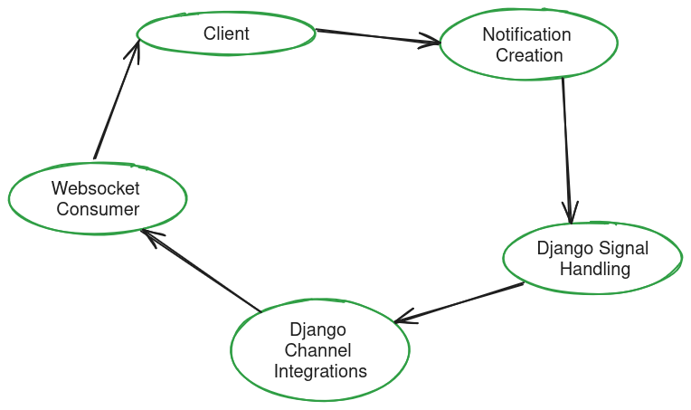

### Procedure of making django notification app

1. **Setting up Django**:
    - Install Django using pip.
    - Create a new Django project using the `django-admin startproject` command.
    - Start a new Django app within your project using the `python manage.py startapp` command.
    - Configure your database settings in the `settings.py` file.
    - Run migrations to create the initial database schema using the `python manage.py migrate` command.
    - Optionally, create a superuser for administrative access using the `python manage.py createsuperuser` command.

2. **Setting up Django Channels**:
    - Install Django Channels using pip.
    - Configure Django Channels in the `settings.py` file by adding `'channels'` to the `INSTALLED_APPS` list.
    - Create a routing configuration in a file named `routing.py`.
    - Define WebSocket URL patterns in the routing configuration to map WebSocket paths to consumer classes.
    - Update the ASGI application to include Django Channels routing.

   **Overview**: If you don't use Django Channels, your Django application won't be able to handle WebSocket connections and real-time communication. Django Channels allows you to handle asynchronous tasks, such as WebSocket communication, alongside synchronous Django views.

3. **Setting up Signals**:
    - Define signal handlers for specific events in your Django models or other parts of your application.
    - Connect signal handlers to the corresponding signals using the `@receiver` decorator or `signal.connect()` method.
    - Implement logic in the signal handlers to perform actions in response to the signals, such as sending notifications or updating related models.

   **Overview**: Signals allow decoupled communication between different parts of your Django application. They're useful for executing code in response to certain events, such as object creation, deletion, or updates. If you don't use signals, you may need to manually call the related logic in multiple places, which can lead to code duplication and tight coupling.

4. **Overview**: In this step, you could document additional topics such as setting up a notification system using Django Channels and signals, designing database models for notifications, and integrating frontend components for real-time notification display. Let me know if you'd like more information on any of these topics or if you have any other specific questions!
### Technical Overview Of this app

Certainly! Here's a technical data flow based on the scenario you described:

1. **Client Interaction**:
    - A user interacts with your Django application, which includes functionality to create notifications.
    - Upon certain actions (e.g., creating a new notification), the client sends a request to the Django server to save the notification data.

2. **Django Signal Handling**:
    - When a new notification instance is saved to the database, a post-save signal (`post_save`) is triggered.
    - A signal handler (`notification_created`) is connected to this signal for the `Notification` model.
    - Inside the signal handler, if the notification instance was just created (`created == True`), the handler retrieves the message from the instance.

3. **Django Channels Integration**:
    - The signal handler uses Django Channels to communicate with WebSocket clients in real-time.
    - It retrieves the channel layer using `get_channel_layer()` to interact with Channels.
    - It then sends a message to the WebSocket group named 'public_room' using `group_send()`.
    - The message contains the notification message as well as a specified type ('send_notification').

4. **WebSocket Consumer**:
    - A WebSocket consumer listens for messages from the 'public_room' group.
    - When a message is received, the consumer processes it according to its type ('send_notification').
    - In this case, the consumer sends the notification message to WebSocket clients connected to the consumer.

5. **WebSocket Client Interaction**:
    - WebSocket clients, typically implemented using JavaScript, are connected to the WebSocket server.
    - They receive messages from the server, including notification messages.
    - When a notification message is received, the client updates the user interface to display the notification icon or any other relevant information.

6. **User Interaction**:
    - The user sees the notification icon or message on the user interface, indicating that a new notification is available.
    - The user can click on the notification icon to view the details of the notification or perform any other relevant action.

This data flow allows for real-time notification delivery from the Django server to WebSocket clients connected to the server. It leverages Django Channels to handle asynchronous communication and signals to trigger actions in response to database changes.

### Diagram Flow

Issue can be faced:

- Make sure redis service is running
- Make suer in /etc/hosts redis host is exist so use `ping redis` command. If not exist use `127.0.0.0.1    redis`.
- Make sure channel configuration specially asgi.py configuration.
- Make sure django setting's channel layer configuration & ASGI server config as well.
